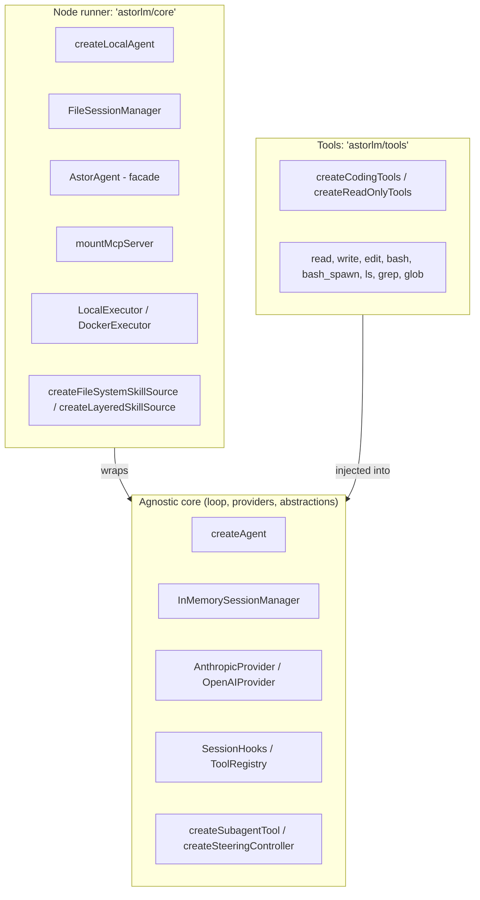

# astorlm 🚀

Embeddable agentic library in TypeScript. Designed with an **SDK-first** approach (no coupled CLI or TUI), letting you integrate a coding agent natively into any TypeScript application.

AstorLM is modular and **runtime-agnostic** at its core, separating the agnostic agent loop from environment adapters and OS-native tooling.

---

## 📦 Module Layout (Entrypoints)

AstorLM ships clearly separated entrypoints. The agnostic core lives behind `astorlm/core` so the loop, providers and abstractions stay portable; the main `astorlm` barrel re-exports both the core and the Node runner for convenience.



### 1. `astorlm` (main barrel)
* **Description**: One-stop import. Exposes the agnostic core (`createAgent`, the providers, `tool`, `ToolRegistry`, sessions, skills, hooks, optimizer, retry, the subagent/steering helpers) **and** re-exports everything from `astorlm/core` for unified imports.
* **Key exports**:
  - `createAgent` (async — `Promise<Agent>`)
  - `InMemorySessionManager`, `SessionManager`
  - `AnthropicProvider`, `OpenAIProvider`
  - `createOpenAIEmbedder`, `cosineSimilarity`, `createSemanticIndex`, `withEmbeddingCache` (embeddings — also at `astorlm/embeddings`)
  - `tool`, `ToolRegistry`
  - `EventBus`, `buildSystemPrompt`, `estimateTokens`, `optimizeContext`, `isTransientError`, `computeBackoffDelay`
  - `createSubagentTool` (subagents / agent-as-tool), `createSteeringController` (out-of-hook steering)
  - `SkillRegistry`, `createInMemorySkillSource`, `parseSkillFrontmatter`, `renderSkillsBlock`, `createLoadSkillTool`
  - `validateSkillName`, `validateSkillDescription`, `validateSkillSpec`, `SkillValidationError`, `SKILL_VALIDATION_LIMITS`
  - `parseAllowedTools`, `restrictToolsHook` (per-skill tool gating)
  - Base types: `Agent`, `CreateAgentOptions`, `SessionHooks`, `Message`, `ContentBlock`, `AgentEvent`, `Skill`, `SkillMetadata`, `SkillSource`, `SkillMode`, etc.

> ⚠️ Because the main barrel re-exports `./core`, importing from `astorlm` pulls in Node-only dependencies. If you target Edge / Workers / browser, import from the agnostic modules directly (the loop, providers and abstractions don't import Node) and avoid the Node runner.

### 2. `astorlm/core` (Node.js runner)
* **Description**: Extensions that require Node.js OS-native APIs (`node:fs`, `node:path`, `node:child_process`).
* **Key exports**:
  - `createLocalAgent` (session factory wired with `LocalExecutor` + a local file reader by default).
  - `FileSessionManager` (history persistence as JSONL plus JSON metadata).
  - `AstorAgent` (simplified execution and branching facade).
  - `mountMcpServer` (adapter and Stdio/HTTP transports for Model Context Protocol clients).
  - `LocalExecutor`, `DockerExecutor` (shell-command backends; see "Executors" below).
  - `createFileSystemSkillSource` (reads skills from a `dir/<name>/SKILL.md` layout).
  - `createLayeredSkillSource` (hierarchical skill discovery — user → project → repo).

### 3. `astorlm/tools` (Built-in tools)
* **Description**: A bundle of filesystem-manipulation and analysis tools tuned for coding agents, with path-traversal protection.
* **Key exports**:
  - `createCodingTools()` (`read`, `write`, `edit`, `bash`, `bash_spawn`, `bash_get_output`, `bash_kill`, `ls`, `grep`, `glob`).
  - `createReadOnlyTools()` (safe variant — no writes or execution: `read`, `ls`, `grep`, `glob`).
  - Individual tools: `readTool`, `writeTool`, `editTool`, `bashTool`, `bashSpawnTool`, `bashGetOutputTool`, `bashKillTool`, `lsTool`, `grepTool`, `globTool`.

### 4. `astorlm/embeddings` (Embeddings & semantic search)
* **Description**: First-class, runtime-agnostic embeddings primitives — sit next to the providers in the main barrel and are also reachable via this dedicated subpath. `fetch`-based, zero extra dependencies, work anywhere `fetch` exists (Node, Deno, browsers, edge).
* **Key exports**:
  - `createOpenAIEmbedder({ baseURL, model, apiKey?, dimensions? })` — OpenAI-compatible `Embedder` with `embed` (single) and `embedMany` (batch, one round-trip) plus token `usage`.
  - `createSemanticIndex({ embedder })` — in-memory vector store: `add` / `addMany` / `query(text, { topK, threshold })` / `queryByVector` / `remove` / `clear`. The reusable primitive behind semantic search, RAG retrieval and dedupe.
  - `withEmbeddingCache(embedder)` — memoizes identical inputs so repeated lookups don't re-embed (or re-bill); `embedMany` only requests the cache misses.
  - `cosineSimilarity` (standard `[-1..1]`), `dotProduct`, `euclideanDistance`.
  - Types: `Embedder`, `EmbedResult`, `EmbedManyResult`, `SemanticIndex`, `SemanticHit`, etc.

```typescript
import { createOpenAIEmbedder, createSemanticIndex } from 'astorlm'

const embedder = createOpenAIEmbedder({
  baseURL: 'http://127.0.0.1:11434/v1',
  model: 'nomic-embed-text',
  apiKey: 'not-needed',
})

const index = createSemanticIndex({ embedder })
await index.addMany([
  { id: 'oom', text: 'Node process crashes with out of memory during the build.' },
  { id: 'tls', text: 'TLS handshake fails: expired certificate in production.' },
])

const hits = await index.query('ran out of RAM while compiling', { topK: 1 })
// → [{ id: 'oom', score: 0.8…, text: '…' }]
```

### 5. `astorlm/experimental/error-registry` (Experimental — Federated Error Registry)
> ⚠️ **Experimental**. Lives under a dedicated subpath, not the main barrel. The import path itself is the signal that the API is volatile and may change between minor releases.

* **Description**: A registry of agent-encountered errors and human-approved resolutions. When an agent hits an error that another agent (or a previous run) has already resolved, the registry injects the fix as a hint into the next `tool_result` — the agent applies the known solution instead of fighting through it again. Honest single-org PoC; federation across organizations and full secret sanitization are out of scope.
* **Key exports**:
  - `createErrorRegistry(opts)` — JSONL append-only store (or in-memory) with optional OpenAI-compatible embeddings and a Jaccard fallback.
  - `errorRegistryHooks({ registry, context, successWindow? })` — returns a `SessionHooks` object that wires the session to the registry.

```typescript
import { createLocalAgent, OpenAIProvider } from 'astorlm'
import { createCodingTools } from 'astorlm/tools'
import { createErrorRegistry, errorRegistryHooks } from 'astorlm/experimental/error-registry'

const registry = createErrorRegistry({
  storePath: '.astorlm/error-registry.jsonl',
  // Optional — if omitted, falls back to Jaccard over tokens:
  // embeddings: { baseURL: 'http://127.0.0.1:11434/v1', model: 'nomic-embed-text' },
})
await registry.init()

const agent = await createLocalAgent({
  provider: new OpenAIProvider({ model: 'myproxyllm', baseURL: 'http://127.0.0.1:11434/v1', apiKey: 'not-needed' }),
  tools: createCodingTools(),
  hooks: errorRegistryHooks({
    registry,
    context: { cwd: process.cwd(), osPlatform: process.platform, nodeVersion: process.version, tags: [] },
  }),
})
// Note: errorRegistryHooks returns a SessionHooks object — if you already
// have your own hooks, merge them into a single object before passing.
```

A human approves pending resolutions asynchronously (e.g. `registry.approveResolution(id, approver)`). Until approved, a candidate resolution is not suggested to other sessions.

### 6. `astorlm/experimental/tracing` (Experimental — Observability)
> ⚠️ **Experimental**. Volatile API behind a dedicated subpath. Runtime-agnostic (reads only the event bus; uses Web Crypto for ids).

* **Description**: Derives a hierarchical span tree (`session → turn → provider_call | tool_execution`) from the agent's event bus **without touching the loop** — attaching a tracer is pure subscription. Spans carry OpenTelemetry GenAI semantic-convention attributes (`gen_ai.*`) plus astorlm-specific ones (TTFT, tool duration/errors, retries).
* **Key exports**:
  - `attachTracer(agent, { exporter })` — subscribes to the bus and builds spans; returns `{ detach(), currentTraceId() }`.
  - `createInMemoryExporter()` — collects spans in an array for tests / local inspection.
  - `createTracer(opts?)` — low-level span factory (usually managed by `attachTracer`).
  - `createOtlpSpanExporter(opts)` (from `astorlm/experimental/tracing/otel`) — OTLP/HTTP (JSON) exporter built on `fetch` alone, **no OpenTelemetry SDK dependency**. Ships spans to any OTLP collector (OpenTelemetry Collector, Tempo, Jaeger, Honeycomb, Arize Phoenix, Langfuse).

```typescript
import { createLocalAgent, OpenAIProvider } from 'astorlm'
import { createCodingTools } from 'astorlm/tools'
import { attachTracer, createInMemoryExporter } from 'astorlm/experimental/tracing'
import { createOtlpSpanExporter } from 'astorlm/experimental/tracing/otel'

const agent = await createLocalAgent({
  provider: new OpenAIProvider({ model: 'myproxyllm', baseURL: 'http://127.0.0.1:11434/v1', apiKey: 'not-needed' }),
  tools: createCodingTools(),
})

// In-memory (inspect locally) ...
const memory = createInMemoryExporter()
// ... and/or export to an OTLP collector:
const otlp = createOtlpSpanExporter({ endpoint: 'http://localhost:4318/v1/traces', serviceName: 'my-agent' })

const tracer = attachTracer(agent, {
  exporter: { export: (spans) => { memory.export(spans); otlp.export(spans) } },
})

await agent.run('List the .ts files and count them.')
tracer.detach()
await otlp.shutdown() // final flush

for (const s of memory.spans) console.log(s.kind, s.name, s.endTime! - s.startTime, 'ms')
```

The OTLP exporter buffers spans and flushes by batch size (`maxBatch`, default 256) or on a timer (`flushIntervalMs`, default 5s, `unref()`-ed). Hex `trace_id`/`span_id` are forwarded verbatim per the OTLP/JSON convention.

### 7. `astorlm/experimental/metrics` (Experimental — Cost & metrics)
> ⚠️ **Experimental**. Runtime-agnostic (reads only the event bus).

* **Description**: Aggregates operational metrics from the agent's event bus and, given a pricing table, the USD cost of a run. No prices are hardcoded — you supply the table (USD per 1M tokens).
* **Key exports**:
  - `attachMetrics(agent, { pricing? })` — subscribes to the bus; returns `{ snapshot(), reset(), detach() }`. The snapshot has counts (`runs`, `turns`, `providerCalls`, `toolCalls`, `toolErrors`, `providerRetries`), `tokens`, optional `costUsd`, and latency stats (`ttftMs`, `turnMs`, `toolMs`).
  - `computeCost(usage, pricing)`, `resolvePricing(table, model)` — usable standalone (exact then longest-prefix model match).

```typescript
import { attachMetrics } from 'astorlm/experimental/metrics'

const metrics = attachMetrics(agent, {
  pricing: { 'gpt-4o': { inputPer1M: 2.5, outputPer1M: 10, cacheReadPer1M: 1.25 } },
})
await agent.run('...')
const m = metrics.snapshot() // { costUsd, latency: { ttftMs: { avg, ... } }, tokens, ... }
```

### 8. `astorlm/experimental/replay` (Experimental — Record & replay)
> ⚠️ **Experimental**. Runtime-agnostic; the `Recording` is a plain serializable object.

* **Description**: Captures exactly the provider events a run produced and replays them later with no network and no token spend — the deterministic debugging primitive. Capture is at the provider boundary, so it's independent of tools, hooks and timing.
* **Key exports**:
  - `createRecordingProvider(inner)` — wraps a real provider, passes events through and records them; `getRecording()` returns a serializable object.
  - `createReplayProvider(recording, { onExhausted? })` — a provider that replays the recording turn by turn.

```typescript
import { createRecordingProvider, createReplayProvider } from 'astorlm/experimental/replay'

const rec = createRecordingProvider(realProvider)
const agent = await createLocalAgent({ provider: rec, tools })
await agent.run('...')
fs.writeFileSync('run.json', JSON.stringify(rec.getRecording()))

// later — same events, no model call
const recording = JSON.parse(fs.readFileSync('run.json', 'utf8'))
const replay = await createLocalAgent({ provider: createReplayProvider(recording), tools })
await replay.run('...')
```

### 9. `astorlm/experimental/evals` (Experimental — Offline evaluation)
> ⚠️ **Experimental**. Runtime-agnostic core; `llmJudge` needs a `Provider` (point it at a local OpenAI-compatible endpoint).

* **Description**: Runs a dataset of cases through fresh agents, applies scorers, and aggregates a report (overall pass rate + per-scorer stats). Built for CI gating; pair the agent factory with the replay provider for fast, network-free regression runs.
* **Key exports**:
  - `runEval({ dataset, createAgent, scorers, concurrency?, onResult? })` → `EvalReport`.
  - Scorers: `exactMatch`, `contains`, `regexMatch`, `toolTrajectory` (tool-call sequence: `'exact' | 'ordered-subset' | 'set'`), `llmJudge` (LLM-as-judge with a rubric → normalized 0..1).

```typescript
import { runEval, contains, toolTrajectory, llmJudge } from 'astorlm/experimental/evals'

const report = await runEval({
  dataset: [{ id: 'q1', input: 'How many .ts files?', expected: 'a number' }],
  createAgent: () => createLocalAgent({ provider: provider(), tools: createReadOnlyTools() }),
  scorers: [contains('.ts'), toolTrajectory(['ls'], { mode: 'set' }), llmJudge({ provider: provider(), rubric: '...' })],
})
if (report.summary.passRate < 0.8) process.exit(1) // CI gate
```

### 10. `astorlm/experimental/wasm-runner` (Experimental — WASM code sandbox)
> ⚠️ **Experimental**. Dedicated subpath, volatile API.

* **Description**: `CodeRunner` — runs untrusted *source code* (not shell commands) inside a memory-safe WebAssembly sandbox with no host access. The daemon-free, runtime-agnostic isolation tier, complementary to `DockerExecutor`. See ["WASM code sandbox"](#-wasm-code-sandbox-astorlmexperimentalwasm-runner) below.
* **Key exports**: `QuickJsCodeRunner` (JS via QuickJS-wasm), `createCodeRunnerTool({ runner })` (opt-in `run_code` tool), plus the `CodeRunner` / `RunCodeOptions` / `RunCodeResult` types.

---

## 🚀 Quick Use Examples

> **All snippets use `OpenAIProvider`** pointed at a local OpenAI-compatible endpoint (Ollama, LM Studio, vLLM, …). `AnthropicProvider` exists in the public API with the same shape — swap it in if you prefer Anthropic.

### 🔌 1. Minimal Usage (custom tool)

```typescript
import { createAgent, OpenAIProvider, tool } from 'astorlm'
import { z } from 'zod'

// 1. Define a custom tool (Zod schema → JSON Schema under the hood)
const getWeather = tool({
  name: 'get_weather',
  description: 'Returns the current temperature for a city',
  schema: z.object({ city: z.string() }),
  execute: async ({ city }) => `Weather in ${city}: 22°C, sunny.`,
})

// 2. Create the session.
//    Note: createAgent is async — it loads any persisted state from the
//    session manager before returning. Always await it.
const agent = await createAgent({
  provider: new OpenAIProvider({ model: 'myproxyllm', baseURL: 'http://127.0.0.1:11434/v1', apiKey: 'not-needed' }),
  tools: [getWeather],
})

// 3. Subscribe to the token stream
agent.on('text', (text) => process.stdout.write(text))

// 4. Run the prompt
await agent.run('How is the weather in Buenos Aires?')
```

---

### 💻 2. Full Coding Agent (Node.js)
The standard setup for building an autonomous backend coding agent with local filesystem access.

```typescript
import { createLocalAgent, OpenAIProvider } from 'astorlm'
import { createCodingTools } from 'astorlm/tools'

const agent = await createLocalAgent({
  cwd: process.cwd(), // safe working directory
  provider: new OpenAIProvider({ model: 'myproxyllm', baseURL: 'http://127.0.0.1:11434/v1', apiKey: 'not-needed' }),
  tools: createCodingTools(), // read, write, edit, bash, bash_spawn, bash_get_output, bash_kill, ls, grep, glob
})

agent.on('text', (text) => process.stdout.write(text))
agent.on('tool-start', (t) => console.log(`\n🛠️  [tool: ${t.name}]`, t.input))

await agent.run('Refactor src/utils.ts to use arrow functions.')
console.log(agent.getUsage()) // { inputTokens, outputTokens, cacheReadTokens?, cacheCreationTokens? }
```

---

### 🗃️ 3. Session & History Persistence (FileSessionManager)
Persist conversation history on disk to resume the agent's work or branch it at any point.

```typescript
import { createLocalAgent, FileSessionManager, OpenAIProvider } from 'astorlm'

// 1. On-disk persister (creates a .jsonl history file + .meta.json per session)
const sessionManager = new FileSessionManager({ dir: './.astor-sessions' })

// 2. Load or create the persistent session. createLocalAgent is async — it
//    loads prior history before resolving, so by the time you have `agent`
//    it's ready to run(). There is no separate initPromise.
const agent = await createLocalAgent({
  sessionId: 'my-refactor-session',
  sessionManager,
  provider: new OpenAIProvider({ model: 'myproxyllm', baseURL: 'http://127.0.0.1:11434/v1', apiKey: 'not-needed' }),
})

await agent.run('Write an optimized fibonacci function.')
```

#### 🌿 Session Branching
Create a child session by copying the messages of an existing session (or truncating up to a given message ID):

```typescript
// Either via the session manager directly...
const childState = await sessionManager.create({
  parentId: 'my-refactor-session',
  branchFromMessageId: 'optional-message-id-cutoff', // omit to clone full history
})

// ...or fork from the live agent:
const child = await agent.fork({ branchFromMessageId: 'optional-message-id-cutoff' })
await child.run('Now rewrite it in TypeScript with strict types?')
```

---

### 🎭 4. Simplified Facade with `AstorAgent`
To streamline recurring flows, `AstorAgent` wraps lifecycle management, output subscription, and branching.

```typescript
import { AstorAgent, FileSessionManager, OpenAIProvider } from 'astorlm'

const agent = new AstorAgent({
  provider: new OpenAIProvider({ model: 'myproxyllm', baseURL: 'http://127.0.0.1:11434/v1', apiKey: 'not-needed' }),
  sessionManager: new FileSessionManager({ dir: './.astor-sessions' }),
  defaultOutputMode: 'verbose', // 'silent' | 'console' | 'verbose' | (event) => void
})

const { sessionId, text } = await agent.runTask('Create a test.js script that adds 2 + 2')

await agent.runBranchTask({
  parentId: sessionId,
  promptText: 'Change that script so it subtracts instead of adding',
  outputMode: 'console',
})
```

---

## 🧬 Subagents (agent-as-tool)

Expose a whole child agent to a parent as a single tool. When the parent calls it, `createSubagentTool` spins up an independent session with its own (typically narrower) system prompt and tool set, runs ONE prompt to completion, and returns the child's final text as the `tool_result`. The parent never sees the child's intermediate turns — only the distilled answer.

The child inherits the parent's `cwd` / `executor` from the `ToolContext`, and the parent's abort signal propagates (cancelling the parent cancels the child mid-flight). Pure composition over the public API — no loop changes.

```typescript
import { createLocalAgent, createSubagentTool, OpenAIProvider } from 'astorlm'
import { createReadOnlyTools, createCodingTools } from 'astorlm/tools'

const provider = () =>
  new OpenAIProvider({ model: 'myproxyllm', baseURL: 'http://127.0.0.1:11434/v1', apiKey: 'not-needed' })

// A focused subagent with a read-only tool surface.
const explorer = createSubagentTool({
  name: 'repo_explorer',
  description: 'Delegate repository exploration: list files, read them, summarise. Pass the task in `task`.',
  provider: provider(),
  systemPrompt: 'You explore repositories with read-only tools and return a concise summary.',
  tools: createReadOnlyTools(),
  maxTurns: 8,
})

const orchestrator = await createLocalAgent({
  provider: provider(),
  tools: [explorer, ...createCodingTools()],
})

await orchestrator.run('Understand this project: list the root .ts files and summarise each in one line.')
```

> Returns the child's final text only — it does not stream the child's intermediate tokens up to the parent.

---

## 🪝 Control Hooks (`SessionHooks`)

Hooks let you intercept the agent loop. Five optional interception points, all can be async:

| Hook | When | Can |
|---|---|---|
| `beforeTurn` | start of each turn | observe `{ turn, messages, ... }` |
| `beforeProviderCall` | before `provider.stream` | **mutate** `{ messages, systemPrompt, tools }` sent to the model |
| `beforeToolExecution` | before each tool | return `{ authorize, mockResult?, steer?, feedback? }` — permission + mocking + steering in one |
| `afterToolExecution` | after each tool | return the final `output` string the model sees (sanitisation / wrapping) |
| `afterTurn` | end of each turn | observe `{ turn, lastMessage, ... }` |

```typescript
import { createLocalAgent, OpenAIProvider } from 'astorlm'
import { createCodingTools } from 'astorlm/tools'

const agent = await createLocalAgent({
  provider: new OpenAIProvider({ model: 'myproxyllm', baseURL: 'http://127.0.0.1:11434/v1', apiKey: 'not-needed' }),
  tools: createCodingTools(),
  hooks: {
    beforeProviderCall: async ({ messages, systemPrompt }) => {
      return { messages, systemPrompt: `${systemPrompt}\nAlways answer in English.` }
    },
    beforeToolExecution: async ({ toolName, input }) => {
      if (toolName === 'bash') {
        const approved = await askUserForPermission((input as any).command)
        return { authorize: approved, mockResult: approved ? undefined : 'Command canceled by the operator.' }
      }
      return { authorize: true }
    },
    afterToolExecution: async ({ toolName, output, durationMs }) => {
      console.log(`[metric] ${toolName} took ${durationMs}ms`)
      return output
    },
  },
})
```

### 🎯 Steering (redirect without aborting)

A `beforeToolExecution` hook returning `{ steer: true, feedback }` cancels the turn's tool calls and feeds the model a `[User Steering Feedback]` note on the next turn — redirecting it without aborting the run. To drive that from *outside* a hook (e.g. a UI button), use `createSteeringController`:

```typescript
import { createLocalAgent, createSteeringController, OpenAIProvider } from 'astorlm'
import { createCodingTools } from 'astorlm/tools'

const controller = createSteeringController() // optionally wraps an existing SessionHooks

const agent = await createLocalAgent({
  provider: new OpenAIProvider({ model: 'myproxyllm', baseURL: 'http://127.0.0.1:11434/v1', apiKey: 'not-needed' }),
  tools: createCodingTools(),
  hooks: controller.hooks,
})

// From anywhere (button handler, watcher, another process):
controller.steer('Stop — do not create files, just list the existing ones.')

await agent.run('Create a file BORRAR.txt with "temp".')
// The queued feedback is consumed at the next tool boundary.
```

> Steering takes effect at the next tool-call boundary, not mid-token.

---

## 🔌 MCP Connectivity (Model Context Protocol)

Mount external MCP servers (local stdio or remote HTTP). Their tools are adapted to the agent standard automatically and prefixed `<server>__<tool>`.

```typescript
import { createLocalAgent, mountMcpServer, OpenAIProvider } from 'astorlm'
import { createCodingTools } from 'astorlm/tools'

const mcpServer = await mountMcpServer({
  name: 'local-fs',
  transport: {
    type: 'stdio',
    command: 'npx',
    args: ['-y', '@modelcontextprotocol/server-filesystem', '/allowed/path'],
  },
})

const agent = await createLocalAgent({
  provider: new OpenAIProvider({ model: 'myproxyllm', baseURL: 'http://127.0.0.1:11434/v1', apiKey: 'not-needed' }),
  tools: [...createCodingTools(), ...mcpServer.tools],
})
```

---

## 📚 Skills (loadable knowledge packs)

A **skill** is a self-contained piece of instructions the agent can consult — a markdown body plus metadata. The SDK has no opinion about where skills come from: the `SkillSource` interface is the seam (filesystem, HTTP registry, in-memory, database).

Three activation modes (`skillMode`):

* `'filesystem'` — **the canonical Agent Skills pattern** (Claude Code, OpenAI Codex, Gemini CLI). The system prompt lists each skill's name, description and the absolute path of its `SKILL.md`; the agent reads it with the standard `read` tool when triggered. No meta-tool. Most robust across models; bundled `scripts/`, `references/`, `assets/` are reachable for free via `read`/`bash`. Requires every skill to expose a path (use `createFileSystemSkillSource`) and the session to include a `read` tool.
* `'on-demand'` (default) — only `{name, description}` go into the system prompt; the session registers a `load_skill` meta-tool the model calls to materialise a body. Scales to many skills; depends on the model invoking a meta-tool.
* `'all'` — every body is concatenated into the system prompt up front. Cheapest at runtime; eats context. Use for a small, always-relevant set.

### From the filesystem

Convention: one directory per skill, each with a `SKILL.md` whose YAML frontmatter declares `name` and `description`. The frontmatter `name` is the source of truth and must match the folder name (drift throws).

```
./.astor-skills/
  pptx/SKILL.md
  refactor/SKILL.md
```

```markdown
---
name: pptx
description: Build PowerPoint decks when the user asks for slides.
# Optional extra fields — captured into Skill.metadata, ignored by the SDK,
# available for your own policy code (filter by tag, gate by version, etc.).
version: 1.2.0
tags: documents, presentation
allowed-tools: read, write, bash
---

# How to build a deck
Use pptx-genjs. Prefer one slide per concept; keep titles under 60 chars.
```

#### Frontmatter rules (Agent Skills spec)

| Field         | Required | Rule |
| ------------- | -------- | ---- |
| `name`        | ✅       | 1–64 chars, regex `^[a-z0-9][a-z0-9-]*$`. Reserved: `anthropic`, `claude`. |
| `description` | ✅       | 1–1024 chars. No XML tags (`<foo>`) — they confuse models that emit native tool-call syntax. |
| any other key | ❌       | Captured into `Skill.metadata: Record<string, string>` verbatim. |

```typescript
import { createLocalAgent, createFileSystemSkillSource, OpenAIProvider } from 'astorlm'
import { createCodingTools } from 'astorlm/tools'

const agent = await createLocalAgent({
  provider: new OpenAIProvider({ model: 'myproxyllm', baseURL: 'http://127.0.0.1:11434/v1', apiKey: 'not-needed' }),
  tools: createCodingTools(),
  skillSources: [createFileSystemSkillSource({ dir: './.astor-skills' })],
  skillMode: 'filesystem',
})

await agent.run('Build a deck about climate change.')
```

### Hierarchical discovery (user → project → repo)

Passing several `createFileSystemSkillSource` directly throws on duplicate names (no silent override). `createLayeredSkillSource` resolves precedence internally (last-wins, loudly via `onOverride`) and presents itself as a single source, so the registry's conflict-throw stays intact for genuine clashes.

```typescript
import { createLayeredSkillSource } from 'astorlm/core'

const layered = createLayeredSkillSource({
  layers: [userSkillsDir, projectSkillsDir], // LOW → HIGH precedence; project wins
  onOverride: ({ name, winner, loser }) =>
    console.log(`"${name}": layer "${winner}" shadows "${loser}"`),
})
// pass in skillSources: [layered]
```

### Per-skill `allowed-tools`

The frontmatter `allowed-tools` field is stored verbatim. Interpret and enforce it with two helpers:

```typescript
import { parseAllowedTools, restrictToolsHook } from 'astorlm'

const allowed = parseAllowedTools(skill) ?? [] // CSV → string[] | null
const hooks = restrictToolsHook(allowed, {
  alwaysAllow: ['read', 'load_skill'], // keep these usable regardless
  denyMessage: (t) => `Tool "${t}" is not in the active skill's allowed-tools.`,
})
// pass `hooks` into createLocalAgent({ hooks })
```

Deciding *which* skill is active (and therefore which allowlist applies) is left to the consumer — combine `parseAllowedTools` with your own logic and merge it into the session hooks. The SDK deliberately does not track an "active skill" in the core.

### From an in-memory bundle

```typescript
import { createInMemorySkillSource } from 'astorlm'

const source = createInMemorySkillSource({
  name: 'shipped-skills',
  skills: [
    {
      name: 'sql-review',
      description: 'Review SQL migrations for safety on a live DB.',
      body: '# SQL review\nCheck for table locks, NOT NULL without default, ...',
      metadata: { version: '1.0.0', 'allowed-tools': 'read, grep' },
    },
  ],
})
```

Conflicting names across sources throw at session creation — there is no silent override.

---

## 🐳 Executors (sandboxing & swappable backends)

Bash-family tools (`bash`, `bash_spawn`, `bash_get_output`, `bash_kill`) never talk to `child_process` directly — they delegate to an `Executor`, making the execution backend pluggable.

* **`LocalExecutor`** (`astorlm/core`) — runs commands in the host process. Default for `createLocalAgent`.
* **`DockerExecutor`** (`astorlm/core`) — runs every command inside a container. Real sandboxing, not a command allowlist.
* **Custom** — implement the `Executor` interface (`exec`, `spawn`, `getOutput`, `kill`, `dispose`) and pass it via `executor`.

```typescript
import { createLocalAgent, DockerExecutor, OpenAIProvider } from 'astorlm'
import { createCodingTools } from 'astorlm/tools'

const agent = await createLocalAgent({
  provider: new OpenAIProvider({ model: 'myproxyllm', baseURL: 'http://127.0.0.1:11434/v1', apiKey: 'not-needed' }),
  tools: createCodingTools(),
  executor: new DockerExecutor({ image: 'node:20-alpine' }),
})
```

The agnostic core ships `createNoopExecutor()` as default — it throws a clear error if a bash tool tries to use it without explicit configuration, so the SDK never silently runs commands on the host.

---

## 🧪 WASM code sandbox (`astorlm/experimental/wasm-runner`)

`CodeRunner` is a sibling primitive to `Executor`, not a replacement for it. Where `Executor` runs **shell commands** with the host toolchain (isolated by Docker, or not at all), `CodeRunner` runs a **self-contained code snippet** inside a memory-safe WebAssembly runtime — no filesystem, no network, no host syscalls unless explicitly granted (capability-based, default-deny).

The key difference: it needs no daemon and no `child_process`, so it runs anywhere WASM does (Node, Deno, the browser, edge) — exactly where `DockerExecutor` cannot reach.

* **`QuickJsCodeRunner`** — JavaScript via QuickJS compiled to WASM (`quickjs-emscripten`, an optional dependency loaded lazily). Per-run fresh context, enforced wall-clock deadline and memory limit, captured `console`, read-only JSON `globals`.
* **`createCodeRunnerTool({ runner })`** — wraps a runner as a `run_code` tool. Opt-in: it is *not* part of `createCodingTools()`; register it explicitly.

```typescript
import { createLocalAgent, OpenAIProvider } from 'astorlm'
import { createReadOnlyTools } from 'astorlm/tools'
import { QuickJsCodeRunner, createCodeRunnerTool } from 'astorlm/experimental/wasm-runner'

const runner = new QuickJsCodeRunner({ timeoutMs: 3_000 })

const agent = await createLocalAgent({
  provider: new OpenAIProvider({ model: 'myproxyllm', baseURL: 'http://127.0.0.1:11434/v1', apiKey: 'not-needed' }),
  tools: [...createReadOnlyTools(), createCodeRunnerTool({ runner })],
})
```

| | `Executor` (Docker) | `CodeRunner` (WASM) |
|---|---|---|
| Runs | shell commands + toolchain | self-contained code snippets |
| Where | Node + Docker daemon only | any runtime (Node/Deno/browser/edge) |
| Isolation | OS-level (read-write cwd mount) | capability-empty, default-deny |
| Cold start | hundreds of ms–s per command | ~ms |

> ⚠️ Experimental API. Python (`PyodideCodeRunner`) is planned behind the same `CodeRunner` interface.

---

## ⏱️ Background processes (`bash_spawn` / `bash_get_output` / `bash_kill`)

Beyond the synchronous `bash` tool, the agent can manage long-running processes:

* `bash_spawn { command }` → returns an opaque `pid`.
* `bash_get_output { pid }` → drains stdout/stderr buffered since the last call, plus status / exit code.
* `bash_kill { pid, signal? }` → terminates the process.

This is what lets the agent launch a dev server, inspect logs, and tear it down without blocking the loop.

---

## 🧭 Loop patterns

`createAgent` / `createLocalAgent` accept `pattern: 'REACT' | 'PLAN_EXECUTE'` (default `'REACT'`).

`'PLAN_EXECUTE'` auto-registers `add_plan_item` and `update_plan_item` tools that mutate a `PlanItem[]`. Each turn the loop injects the plan state into the system prompt (same idea as a visible, mutable to-do list). The plan persists in session metadata and survives resume/fork; read it with `agent.getPlan()`.

## 📉 Context optimizer (auto-compaction)

When the provider exposes a `contextLimit`, the loop runs a structural optimizer between turns that prunes / dedupes once the conversation crosses a threshold. It's structural (prune / dedupe), not LLM-based summarization.

```typescript
const agent = await createLocalAgent({
  provider: /* ... */,
  contextOptimizer: {
    maxTokens: 200_000,
    compressThreshold: 0.8, // optimize when usage > 80% of maxTokens
    keepRecentTurns: 3,     // always keep the last N turns verbatim
  },
})
// Disable entirely: contextOptimizer: false
// Implicit default: enabled if provider.contextLimit is set, off otherwise.
```

## 🔁 Retry policy for transient provider errors

Opt-in retries for transient failures (HTTP 429, 5xx, network timeouts, streams cut before any chunk). Already-streamed events are never duplicated — once any event is emitted on an attempt, the loop will not retry that turn.

```typescript
const agent = await createLocalAgent({
  provider: /* ... */,
  retry: { maxAttempts: 3, baseDelayMs: 500, maxDelayMs: 10_000, jitter: true },
})
// Default (omitted): no retries — errors propagate and the session closes with session_end: error.
```

## 📊 Token usage tracking

```typescript
await agent.run('...')
console.log(agent.getUsage())
// { inputTokens, outputTokens, cacheReadTokens?, cacheCreationTokens? }
```

No pricing layer — raw counts only. `cacheReadTokens` / `cacheCreationTokens` are populated when the provider reports them (Anthropic always; OpenAI's `cached_tokens` when applicable; many OpenAI-compat endpoints leave them undefined).

## 🫀 Heartbeat (proactive loop)

`agent.startHeartbeat(opts?)` / `agent.stopHeartbeat()` (or pass `heartbeat` to the factory) run a check prompt on an interval. A `localCondition(cwd)` enables the **latent heartbeat**: the check runs locally in TypeScript and only wakes the LLM when it returns `true` — zero token cost until the trigger fires.

---

## 🛠️ Development Commands

```bash
pnpm install          # install dependencies
pnpm build            # build the library (dist/ in ESM, CJS, and d.ts) — respects every entrypoint
pnpm dev              # interactive watch-mode build
pnpm test             # run the unit test suite (Vitest)
pnpm typecheck        # run TypeScript type checking without emitting
```
