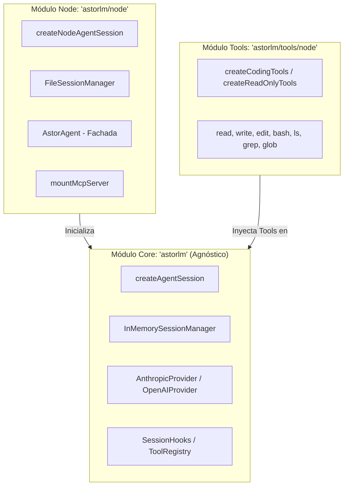

# astorlm 🚀

Librería agéntica embebible en TypeScript. Diseñada bajo un enfoque **SDK-first** (sin CLI ni TUI acoplados), permitiendo integrar un coding agent de forma nativa en cualquier aplicación TypeScript.

AstorLM es modular y **runtime-agnostic** por defecto, separando las capacidades del núcleo de los adaptadores de entorno y herramientas nativas del sistema operativo.

---

## 📦 Estructura de Módulos (Entrypoints)

AstorLM expone tres entrypoints bien diferenciados en su empaquetado para evitar arrastrar dependencias orientadas a Node.js cuando se despliega en entornos Edge, Cloudflare Workers o navegadores:



### 1. `astorlm` (Core Runtime-Agnostic)
* **Descripción**: El núcleo del framework. Contiene el bucle del agente (`loop.ts`), el bus de eventos, los proveedores de LLM y la abstracción base de sesiones y herramientas.
* **Entorno**: Funciona en cualquier runtime de JavaScript (Node.js, Deno, Bun, Cloudflare Workers, Edge Runtimes, Navegador).
* **Exportaciones clave**:
  - `createAgentSession`
  - `InMemorySessionManager`
  - `AnthropicProvider`, `OpenAIProvider`
  - `defineTool`, `ToolRegistry`
  - `EventBus`
  - Tipos base: `AgentSession`, `SessionHooks`, `Message`, `ContentBlock`, `AgentEvent`, etc.

### 2. `astorlm/node` (Extensiones para Node.js)
* **Descripción**: Extensiones y utilidades que requieren APIs nativas del sistema operativo en Node.js (como `node:fs`, `node:path`, `node:child_process`).
* **Exportaciones clave**:
  - `createNodeAgentSession` (creador de sesiones configurado con lector de archivos local por defecto).
  - `FileSessionManager` (persistencia del historial en formato JSONL y metadatos en JSON).
  - `mountMcpServer` (adaptador y transport Stdio/HTTP para clientes de Model Context Protocol).
  - `AstorAgent` (fachada simplificada de ejecución y branching).

### 3. `astorlm/tools/node` (Herramientas Built-in para Node.js)
* **Descripción**: Conjunto de herramientas de manipulación y análisis del filesystem optimizadas para agentes de coding, con resguardo anti-path-traversal.
* **Exportaciones clave**:
  - `createCodingTools()` (devuelve un array con `read`, `write`, `edit`, `bash`, `ls`, `grep`, `glob`).
  - `createReadOnlyTools()` (versión segura sin escritura ni ejecución: `read`, `ls`, `grep`, `glob`).
  - Herramientas individuales exportadas directamente: `readTool`, `writeTool`, `editTool`, `bashTool`, `lsTool`, `grepTool`, `globTool`.

### 4. `astorlm/experimental/error-registry` (Experimental — Federated Error Registry)
> ⚠️ **Experimental**. Lives under a dedicated subpath, not the main barrel. The import path itself is the signal that the API is volatile and may change between minor releases.

* **Description**: A registry of agent-encountered errors and human-approved resolutions. When an agent hits an error that another agent (or a previous run) has already resolved, the registry injects the fix as a hint into the next `tool_result` — the agent applies the known solution instead of fighting through it again. Honest single-org PoC; federation across organizations and full secret sanitization are out of scope.
* **Key exports**:
  - `createErrorRegistry(opts)` — JSONL append-only store (or in-memory) with optional OpenAI-compatible embeddings and a Jaccard fallback. Exposes `query`, `ensureEntry`, `recordResolution`, `approveResolution`, `rejectResolution`, `noteSuccessfulReuse`, `listPending`, `listEntries`.
  - `errorRegistryHooks({ registry, context, successWindow? })` — returns a `SessionHooks` object that wires the session to the registry: detects errors, injects hints, records candidate resolutions as `pending` after a recovery without recurrence.
  - Types: `ErrorRegistry`, `ErrorEntry`, `Resolution`, `RegistryHit`, `ErrorContext`, `ApprovalStatus`, etc.

```typescript
import { createNodeAgentSession } from 'astorlm/node'
import { createCodingTools } from 'astorlm/tools/node'
import { OpenAIProvider } from 'astorlm'
import {
  createErrorRegistry,
  errorRegistryHooks,
} from 'astorlm/experimental/error-registry'

const registry = createErrorRegistry({
  storePath: '.astorlm/error-registry.jsonl',
  // Optional — if omitted, falls back to Jaccard over tokens:
  // embeddings: { baseURL: 'http://127.0.0.1:11434/v1', model: 'nomic-embed-text' },
})
await registry.init()

const session = await createNodeAgentSession({
  provider: new OpenAIProvider({ model: 'myproxyllm', baseURL: 'http://127.0.0.1:11434/v1', apiKey: 'not-needed' }),
  tools: createCodingTools(),
  hooks: errorRegistryHooks({
    registry,
    context: { cwd: process.cwd(), osPlatform: process.platform, nodeVersion: process.version, tags: [] },
  }),
})
```

A human approves pending resolutions asynchronously (programmatically via `registry.approveResolution(id, approver)` or via a CLI). Until approved, a candidate resolution is not suggested to other sessions.

---

## 🚀 Guías de Uso Rápido (Quick Use Examples)

### 🔌 1. Uso Mínimo y Agnóstico (Core)
Ideal para ejecutar en navegadores o Edge Workers, usando herramientas personalizadas y persistencia en memoria.

```typescript
import { createAgentSession, AnthropicProvider, defineTool } from 'astorlm'
import { z } from 'zod'

// 1. Definir una herramienta personalizada
const obtenerClima = defineTool({
  name: 'obtener_clima',
  description: 'Obtiene la temperatura actual para una ciudad',
  schema: z.object({ ciudad: z.string() }),
  execute: async ({ ciudad }) => `El clima en ${ciudad} es de 22°C, soleado.`
})

// 2. Crear sesión usando el Core Agnóstico
const session = createAgentSession({
  provider: new AnthropicProvider({ model: 'claude-3-5-sonnet-20241022' }),
  tools: [obtenerClima],
})

// 3. Suscribirse al flujo de tokens
session.subscribe((event) => {
  if (event.type === 'text_delta') {
    console.log(event.text) // O pintar en la UI
  }
})

// 4. Iniciar el prompt
await session.prompt('¿Cómo está el clima en Buenos Aires?')
```

---

### 💻 2. Agente de Coding Completo (Node.js)
El setup estándar para construir un agente autónomo de desarrollo en backend con acceso al sistema de archivos local.

```typescript
import { createNodeAgentSession } from 'astorlm/node'
import { createCodingTools } from 'astorlm/tools/node'
import { AnthropicProvider } from 'astorlm'

const session = createNodeAgentSession({
  cwd: process.cwd(), // directorio de trabajo seguro
  provider: new AnthropicProvider({ model: 'claude-3-5-sonnet-20241022' }),
  tools: createCodingTools(), // herramientas de lectura, escritura, edición y bash
})

session.subscribe((e) => {
  if (e.type === 'text_delta') {
    process.stdout.write(e.text)
  }
  if (e.type === 'tool_execution_start') {
    console.log(`\n🛠️  [Ejecutando tool: ${e.name}] con input:`, e.input)
  }
})

await session.prompt('Refactoriza el archivo src/utils.ts para usar funciones flecha.')
```

---

### 🗃️ 3. Persistencia de Sesiones e Historiales (FileSessionManager)
Puedes guardar físicamente el historial de las conversaciones para reanudar el trabajo del agente o ramificar el proceso en cualquier momento.

```typescript
import { createNodeAgentSession, FileSessionManager } from 'astorlm/node'
import { AnthropicProvider } from 'astorlm'

// 1. Inicializar el persistidor en disco (crea un archivo .jsonl de historial y .meta.json de metadatos)
const sessionManager = new FileSessionManager({ dir: './.astor-sessions' })

// 2. Cargar o crear sesión persistente
const session = createNodeAgentSession({
  sessionId: 'mi-sesion-de-refactor',
  sessionManager,
  provider: new AnthropicProvider({ model: 'claude-3-5-sonnet-20241022' }),
})

// Importante: esperar a que termine de cargar el historial previo en memoria
await session.initPromise

await session.prompt('Escribe una función fibonacci optimizada.')
```

#### 🌿 Branching (Bifurcación de Sesiones)
Puedes crear una sesión hija copiando los mensajes de una sesión existente (o recortando hasta cierto ID de mensaje):

```typescript
// Bifurca el estado actual
const childState = await sessionManager.create({
  parentId: 'mi-sesion-de-refactor',
  branchFromMessageId: 'opcional-id-mensaje-limite', // Si se omite, clona todo
})

const childSession = createNodeAgentSession({
  sessionId: childState.id,
  sessionManager,
  provider: new AnthropicProvider({ model: 'claude-3-5-sonnet-20241022' }),
})

await childSession.initPromise
await childSession.prompt('¿Puedes reescribirla en TypeScript con tipos estrictos?')
```

---

### 🎭 4. Fachada Simplificada con `AstorAgent`
Para simplificar la lógica de flujos recurrentes, `AstorAgent` abstrae la gestión del ciclo de vida, la subscripción de salida de consola y el branching.

```typescript
import { AstorAgent, FileSessionManager } from 'astorlm/node'
import { AnthropicProvider } from 'astorlm'

const agent = new AstorAgent({
  provider: new AnthropicProvider({ model: 'claude-3-5-sonnet-20241022' }),
  sessionManager: new FileSessionManager({ dir: './.astor-sessions' }),
  defaultOutputMode: 'verbose', // 'silent' | 'console' | 'verbose'
})

// Ejecuta y maneja el ciclo completo del prompt
const { sessionId, text } = await agent.runTask('Crea un script test.js que sume 2 + 2')

// Crea una bifurcación directamente y ejecuta una tarea derivada
await agent.runBranchTask({
  parentId: sessionId,
  promptText: 'Modifica ese script para que reste en lugar de sumar',
  outputMode: 'console',
})
```

---

## 🪝 Mecanismos de Control (`SessionHooks`)

Los hooks permiten interceptar el ciclo del bucle del agente. Son ideales para implementar:
* **Human-in-the-loop (HITL)**: Confirmación humana de herramientas destructivas (ej. `bash` o modificaciones críticas).
* **Sanitización de entradas/salidas**: Filtros de seguridad en datos de salida o inyección de prompts dinámicos.
* **Mocking**: Simular ejecuciones de herramientas.

```typescript
import { createNodeAgentSession } from 'astorlm/node'
import { createCodingTools } from 'astorlm/tools/node'
import { AnthropicProvider } from 'astorlm'

const session = createNodeAgentSession({
  provider: new AnthropicProvider({ model: 'claude-3-5-sonnet-20241022' }),
  tools: createCodingTools(),
  hooks: {
    // 1. Intercepta llamadas antes de ir al Provider de LLM
    beforeProviderCall: async ({ messages, systemPrompt }) => {
      // Modifica o añade contexto al prompt de sistema al vuelo
      return { messages, systemPrompt: `${systemPrompt}\nResponde siempre en español.` }
    },

    // 2. Seguridad y validación de ejecución de herramientas
    beforeToolExecution: async ({ toolName, input }) => {
      if (toolName === 'bash') {
        const cmd = (input as any).command
        console.log(`\n⚠️  El agente quiere ejecutar en consola: "${cmd}"`)
        const userApproved = await askUserForPermission(cmd)
        
        return { 
          authorize: userApproved,
          // Si no se autoriza, opcionalmente se puede mockear un resultado para el LLM:
          mockResult: userApproved ? undefined : 'Comando cancelado por el operador humano.'
        }
      }
      return { authorize: true }
    },

    // 3. Transformación del resultado de las herramientas
    afterToolExecution: async ({ toolName, output, durationMs }) => {
      console.log(`[Metric] Tool ${toolName} demoró ${durationMs}ms`)
      // Retorna el string final que consumirá el LLM
      return output
    }
  }
})
```

---

## 🔌 Conectividad MCP (Model Context Protocol)

Puedes montar servidores MCP externos (locales o remotos) que expongan herramientas. Las herramientas se adaptan al estándar del agente de forma automática.

```typescript
import { createNodeAgentSession, mountMcpServer } from 'astorlm/node'
import { createCodingTools } from 'astorlm/tools/node'
import { AnthropicProvider } from 'astorlm'

// 1. Montar un servidor MCP de filesystem vía stdio
const mcpServer = await mountMcpServer({
  name: 'local-fs',
  transport: {
    type: 'stdio',
    command: 'npx',
    args: ['-y', '@modelcontextprotocol/server-filesystem', '/ruta/permitida'],
  },
})

// 2. Configurar la sesión combinando herramientas locales y de MCP
const session = createNodeAgentSession({
  provider: new AnthropicProvider({ model: 'claude-3-5-sonnet-20241022' }),
  tools: [
    ...createCodingTools(),
    ...mcpServer.tools, // Expuestas bajo el nombre "local-fs__<tool>"
  ],
})
```

---

## 🛠️ Comandos de Desarrollo

```bash
pnpm install          # Instala dependencias
pnpm build            # Compila la librería (dist/ en ESM, CJS y d.ts)
pnpm dev              # Compilación interactiva en watch mode
pnpm test             # Corre la suite de tests unitarios (Vitest)
pnpm typecheck        # Ejecuta verificación de tipos de TypeScript sin emitir
```
