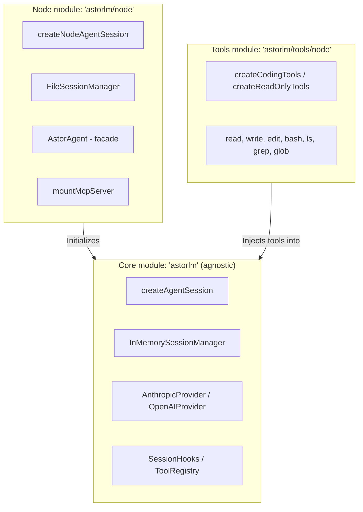

# astorlm 🚀

Embeddable agentic library in TypeScript. Designed with an **SDK-first** approach (no coupled CLI or TUI), letting you integrate a coding agent natively into any TypeScript application.

AstorLM is modular and **runtime-agnostic** by default, separating the core capabilities from environment adapters and OS-native tooling.

---

## 📦 Module Layout (Entrypoints)

AstorLM ships three clearly separated entrypoints so you do not drag Node.js-only dependencies into Edge, Cloudflare Workers, or browser deployments:



### 1. `astorlm` (Core Runtime-Agnostic)
* **Description**: The framework core. Contains the agent loop (`loop.ts`), the event bus, the LLM providers, and the base abstractions for sessions and tools.
* **Runtime**: Works in any JavaScript runtime (Node.js, Deno, Bun, Cloudflare Workers, Edge runtimes, browsers).
* **Key exports**:
  - `createAgentSession`
  - `InMemorySessionManager`
  - `AnthropicProvider`, `OpenAIProvider`
  - `defineTool`, `ToolRegistry`
  - `EventBus`
  - Base types: `AgentSession`, `SessionHooks`, `Message`, `ContentBlock`, `AgentEvent`, etc.

### 2. `astorlm/node` (Node.js extensions)
* **Description**: Extensions and utilities that require Node.js OS-native APIs (`node:fs`, `node:path`, `node:child_process`).
* **Key exports**:
  - `createNodeAgentSession` (session factory wired with a local file reader by default).
  - `FileSessionManager` (history persistence as JSONL plus JSON metadata).
  - `mountMcpServer` (adapter and Stdio/HTTP transports for Model Context Protocol clients).
  - `AstorAgent` (simplified execution and branching facade).

### 3. `astorlm/tools/node` (Built-in tools for Node.js)
* **Description**: A bundle of filesystem-manipulation and analysis tools tuned for coding agents, with path-traversal protection.
* **Key exports**:
  - `createCodingTools()` (returns an array with `read`, `write`, `edit`, `bash`, `ls`, `grep`, `glob`).
  - `createReadOnlyTools()` (safe variant — no writes or execution: `read`, `ls`, `grep`, `glob`).
  - Individual tools exported directly: `readTool`, `writeTool`, `editTool`, `bashTool`, `lsTool`, `grepTool`, `globTool`.

### 4. `astorlm/experimental/error-registry` (Experimental — Federated Error Registry)
> ⚠️ **Experimental**. Lives under a dedicated subpath, not the main barrel. The import path itself is the signal that the API is volatile and may change between minor releases.

* **Description**: A registry of agent-encountered errors and human-approved resolutions. When an agent hits an error that another agent (or a previous run) has already resolved, the registry injects the fix as a hint into the next `tool_result` — the agent applies the known solution instead of fighting through it again. Honest single-org PoC; federation across organizations and full secret sanitization are out of scope.
* **Key exports**:
  - `createErrorRegistry(opts)` — JSONL append-only store (or in-memory) with optional OpenAI-compatible embeddings and a Jaccard fallback. Exposes `query`, `ensureEntry`, `recordResolution`, `approveResolution`, `rejectResolution`, `noteSuccessfulReuse`, `listPending`, `listEntries`.
  - `errorRegistryHooks({ registry, context, successWindow? })` — returns a `SessionHooks` object that wires the session to the registry: detects errors, injects hints, records candidate resolutions as `pending` after a recovery without recurrence.
  - Types: `ErrorRegistry`, `ErrorEntry`, `Resolution`, `RegistryHit`, `ErrorContext`, `ApprovalStatus`, etc.

```typescript
import { createNodeAgentSession } from 'astorlm/node'
import { createCodingTools } from 'astorlm/tools/node'
import { OpenAIProvider } from 'astorlm'
import {
  createErrorRegistry,
  errorRegistryHooks,
} from 'astorlm/experimental/error-registry'

const registry = createErrorRegistry({
  storePath: '.astorlm/error-registry.jsonl',
  // Optional — if omitted, falls back to Jaccard over tokens:
  // embeddings: { baseURL: 'http://127.0.0.1:11434/v1', model: 'nomic-embed-text' },
})
await registry.init()

const session = await createNodeAgentSession({
  provider: new OpenAIProvider({ model: 'myproxyllm', baseURL: 'http://127.0.0.1:11434/v1', apiKey: 'not-needed' }),
  tools: createCodingTools(),
  hooks: errorRegistryHooks({
    registry,
    context: { cwd: process.cwd(), osPlatform: process.platform, nodeVersion: process.version, tags: [] },
  }),
})
```

A human approves pending resolutions asynchronously (programmatically via `registry.approveResolution(id, approver)` or via a CLI). Until approved, a candidate resolution is not suggested to other sessions.

---

## 🚀 Quick Use Examples

### 🔌 1. Minimal Agnostic Usage (Core)
Ideal for running in browsers or Edge workers, with custom tools and in-memory persistence.

```typescript
import { createAgentSession, AnthropicProvider, defineTool } from 'astorlm'
import { z } from 'zod'

// 1. Define a custom tool
const getWeather = defineTool({
  name: 'get_weather',
  description: 'Returns the current temperature for a city',
  schema: z.object({ city: z.string() }),
  execute: async ({ city }) => `Weather in ${city}: 22°C, sunny.`,
})

// 2. Create a session backed by the agnostic core
const session = createAgentSession({
  provider: new AnthropicProvider({ model: 'claude-3-5-sonnet-20241022' }),
  tools: [getWeather],
})

// 3. Subscribe to the token stream
session.subscribe((event) => {
  if (event.type === 'text_delta') {
    console.log(event.text) // or paint into UI
  }
})

// 4. Run the prompt
await session.prompt('How is the weather in Buenos Aires?')
```

---

### 💻 2. Full Coding Agent (Node.js)
The standard setup for building an autonomous backend coding agent with local filesystem access.

```typescript
import { createNodeAgentSession } from 'astorlm/node'
import { createCodingTools } from 'astorlm/tools/node'
import { AnthropicProvider } from 'astorlm'

const session = createNodeAgentSession({
  cwd: process.cwd(), // safe working directory
  provider: new AnthropicProvider({ model: 'claude-3-5-sonnet-20241022' }),
  tools: createCodingTools(), // read, write, edit, bash tools
})

session.subscribe((e) => {
  if (e.type === 'text_delta') {
    process.stdout.write(e.text)
  }
  if (e.type === 'tool_execution_start') {
    console.log(`\n🛠️  [Running tool: ${e.name}] with input:`, e.input)
  }
})

await session.prompt('Refactor src/utils.ts to use arrow functions.')
```

---

### 🗃️ 3. Session & History Persistence (FileSessionManager)
You can persist conversation history on disk to resume the agent's work or branch it at any point.

```typescript
import { createNodeAgentSession, FileSessionManager } from 'astorlm/node'
import { AnthropicProvider } from 'astorlm'

// 1. Initialize the on-disk persister (creates a .jsonl history file + .meta.json)
const sessionManager = new FileSessionManager({ dir: './.astor-sessions' })

// 2. Load or create the persistent session
const session = createNodeAgentSession({
  sessionId: 'my-refactor-session',
  sessionManager,
  provider: new AnthropicProvider({ model: 'claude-3-5-sonnet-20241022' }),
})

// Important: wait for prior history to finish loading into memory
await session.initPromise

await session.prompt('Write an optimized fibonacci function.')
```

#### 🌿 Session Branching
You can create a child session by copying the messages of an existing session (or truncating up to a given message ID):

```typescript
// Branch the current state
const childState = await sessionManager.create({
  parentId: 'my-refactor-session',
  branchFromMessageId: 'optional-message-id-cutoff', // if omitted, clones the full history
})

const childSession = createNodeAgentSession({
  sessionId: childState.id,
  sessionManager,
  provider: new AnthropicProvider({ model: 'claude-3-5-sonnet-20241022' }),
})

await childSession.initPromise
await childSession.prompt('Can you rewrite it in TypeScript with strict types?')
```

---

### 🎭 4. Simplified Facade with `AstorAgent`
To streamline recurring flows, `AstorAgent` wraps lifecycle management, console subscription, and branching.

```typescript
import { AstorAgent, FileSessionManager } from 'astorlm/node'
import { AnthropicProvider } from 'astorlm'

const agent = new AstorAgent({
  provider: new AnthropicProvider({ model: 'claude-3-5-sonnet-20241022' }),
  sessionManager: new FileSessionManager({ dir: './.astor-sessions' }),
  defaultOutputMode: 'verbose', // 'silent' | 'console' | 'verbose'
})

// Run and manage the full prompt lifecycle
const { sessionId, text } = await agent.runTask('Create a test.js script that adds 2 + 2')

// Branch directly and run a derived task
await agent.runBranchTask({
  parentId: sessionId,
  promptText: 'Change that script so it subtracts instead of adding',
  outputMode: 'console',
})
```

---

## 🪝 Control Hooks (`SessionHooks`)

Hooks let you intercept the agent loop. They are ideal for:
* **Human-in-the-loop (HITL)**: human confirmation of destructive tools (e.g. `bash` or critical edits).
* **Input/output sanitization**: security filters on output data or dynamic prompt injection.
* **Mocking**: simulating tool executions.

```typescript
import { createNodeAgentSession } from 'astorlm/node'
import { createCodingTools } from 'astorlm/tools/node'
import { AnthropicProvider } from 'astorlm'

const session = createNodeAgentSession({
  provider: new AnthropicProvider({ model: 'claude-3-5-sonnet-20241022' }),
  tools: createCodingTools(),
  hooks: {
    // 1. Intercept calls before they reach the LLM provider
    beforeProviderCall: async ({ messages, systemPrompt }) => {
      // Modify or append context to the system prompt on the fly
      return { messages, systemPrompt: `${systemPrompt}\nAlways answer in English.` }
    },

    // 2. Tool-execution gatekeeping
    beforeToolExecution: async ({ toolName, input }) => {
      if (toolName === 'bash') {
        const cmd = (input as any).command
        console.log(`\n⚠️  Agent wants to run: "${cmd}"`)
        const userApproved = await askUserForPermission(cmd)

        return {
          authorize: userApproved,
          // If not authorized, you can optionally hand the LLM a mock result:
          mockResult: userApproved ? undefined : 'Command canceled by the human operator.',
        }
      }
      return { authorize: true }
    },

    // 3. Transform the tool result before the LLM consumes it
    afterToolExecution: async ({ toolName, output, durationMs }) => {
      console.log(`[Metric] Tool ${toolName} took ${durationMs}ms`)
      // Return the final string the LLM will see
      return output
    },
  },
})
```

---

## 🔌 MCP Connectivity (Model Context Protocol)

You can mount external MCP servers (local or remote) that expose tools. Tools are adapted to the agent standard automatically.

```typescript
import { createNodeAgentSession, mountMcpServer } from 'astorlm/node'
import { createCodingTools } from 'astorlm/tools/node'
import { AnthropicProvider } from 'astorlm'

// 1. Mount a filesystem MCP server via stdio
const mcpServer = await mountMcpServer({
  name: 'local-fs',
  transport: {
    type: 'stdio',
    command: 'npx',
    args: ['-y', '@modelcontextprotocol/server-filesystem', '/allowed/path'],
  },
})

// 2. Configure the session combining local + MCP tools
const session = createNodeAgentSession({
  provider: new AnthropicProvider({ model: 'claude-3-5-sonnet-20241022' }),
  tools: [
    ...createCodingTools(),
    ...mcpServer.tools, // exposed as "local-fs__<tool>"
  ],
})
```

---

## 🛠️ Development Commands

```bash
pnpm install          # install dependencies
pnpm build            # build the library (dist/ in ESM, CJS, and d.ts)
pnpm dev              # interactive watch-mode build
pnpm test             # run the unit test suite (Vitest)
pnpm typecheck        # run TypeScript type checking without emitting
```
