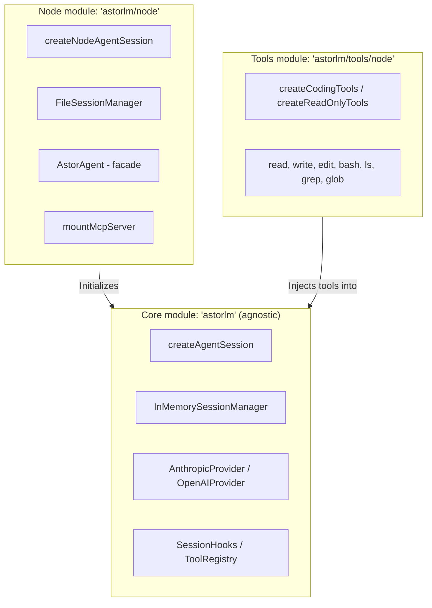

# astorlm 🚀

Embeddable agentic library in TypeScript. Designed with an **SDK-first** approach (no coupled CLI or TUI), letting you integrate a coding agent natively into any TypeScript application.

AstorLM is modular and **runtime-agnostic** by default, separating the core capabilities from environment adapters and OS-native tooling.

---

## 📦 Module Layout (Entrypoints)

AstorLM ships three clearly separated entrypoints so you do not drag Node.js-only dependencies into Edge, Cloudflare Workers, or browser deployments:



### 1. `astorlm` (Core Runtime-Agnostic)
* **Description**: The framework core. Contains the agent loop (`loop.ts`), the event bus, the LLM providers, and the base abstractions for sessions, tools, and skills.
* **Runtime**: Works in any JavaScript runtime (Node.js, Deno, Bun, Cloudflare Workers, Edge runtimes, browsers).
* **Key exports**:
  - `createAgentSession`
  - `InMemorySessionManager`
  - `AnthropicProvider`, `OpenAIProvider`
  - `defineTool`, `ToolRegistry`
  - `EventBus`
  - `SkillRegistry`, `createInMemorySkillSource`, `parseSkillFrontmatter`, `renderSkillsBlock`, `createLoadSkillTool`
  - `validateSkillName`, `validateSkillDescription`, `validateSkillSpec`, `SkillValidationError`, `SKILL_VALIDATION_LIMITS` (spec-level frontmatter validation, aligned with the Agent Skills standard)
  - Base types: `AgentSession`, `SessionHooks`, `Message`, `ContentBlock`, `AgentEvent`, `Skill`, `SkillMetadata`, `SkillSource`, `SkillMode`, etc.

### 2. `astorlm/node` (Node.js extensions)
* **Description**: Extensions and utilities that require Node.js OS-native APIs (`node:fs`, `node:path`, `node:child_process`).
* **Key exports**:
  - `createNodeAgentSession` (session factory wired with a local file reader by default).
  - `FileSessionManager` (history persistence as JSONL plus JSON metadata).
  - `mountMcpServer` (adapter and Stdio/HTTP transports for Model Context Protocol clients).
  - `AstorAgent` (simplified execution and branching facade).
  - `LocalExecutor`, `DockerExecutor` (shell-command backends; see "Executors" below).
  - `createFileSystemSkillSource` (reads skills from a `dir/<name>/SKILL.md` layout).

### 3. `astorlm/tools/node` (Built-in tools for Node.js)
* **Description**: A bundle of filesystem-manipulation and analysis tools tuned for coding agents, with path-traversal protection.
* **Key exports**:
  - `createCodingTools()` (returns an array with `read`, `write`, `edit`, `bash`, `ls`, `grep`, `glob`).
  - `createReadOnlyTools()` (safe variant — no writes or execution: `read`, `ls`, `grep`, `glob`).
  - Individual tools exported directly: `readTool`, `writeTool`, `editTool`, `bashTool`, `lsTool`, `grepTool`, `globTool`.

### 4. `astorlm/experimental/error-registry` (Experimental — Federated Error Registry)
> ⚠️ **Experimental**. Lives under a dedicated subpath, not the main barrel. The import path itself is the signal that the API is volatile and may change between minor releases.

* **Description**: A registry of agent-encountered errors and human-approved resolutions. When an agent hits an error that another agent (or a previous run) has already resolved, the registry injects the fix as a hint into the next `tool_result` — the agent applies the known solution instead of fighting through it again. Honest single-org PoC; federation across organizations and full secret sanitization are out of scope.
* **Key exports**:
  - `createErrorRegistry(opts)` — JSONL append-only store (or in-memory) with optional OpenAI-compatible embeddings and a Jaccard fallback. Exposes `query`, `ensureEntry`, `recordResolution`, `approveResolution`, `rejectResolution`, `noteSuccessfulReuse`, `listPending`, `listEntries`.
  - `errorRegistryHooks({ registry, context, successWindow? })` — returns a `SessionHooks` object that wires the session to the registry: detects errors, injects hints, records candidate resolutions as `pending` after a recovery without recurrence.
  - Types: `ErrorRegistry`, `ErrorEntry`, `Resolution`, `RegistryHit`, `ErrorContext`, `ApprovalStatus`, etc.

```typescript
import { createNodeAgentSession } from 'astorlm/node'
import { createCodingTools } from 'astorlm/tools/node'
import { OpenAIProvider } from 'astorlm'
import {
  createErrorRegistry,
  errorRegistryHooks,
} from 'astorlm/experimental/error-registry'

const registry = createErrorRegistry({
  storePath: '.astorlm/error-registry.jsonl',
  // Optional — if omitted, falls back to Jaccard over tokens:
  // embeddings: { baseURL: 'http://127.0.0.1:11434/v1', model: 'nomic-embed-text' },
})
await registry.init()

const session = await createNodeAgentSession({
  provider: new OpenAIProvider({ model: 'myproxyllm', baseURL: 'http://127.0.0.1:11434/v1', apiKey: 'not-needed' }),
  tools: createCodingTools(),
  hooks: errorRegistryHooks({
    registry,
    context: { cwd: process.cwd(), osPlatform: process.platform, nodeVersion: process.version, tags: [] },
  }),
})
// Note: errorRegistryHooks returns a SessionHooks object — if you already
// have your own hooks, merge them into a single object before passing.
```

A human approves pending resolutions asynchronously (programmatically via `registry.approveResolution(id, approver)` or via a CLI). Until approved, a candidate resolution is not suggested to other sessions.

---

## 🚀 Quick Use Examples

### 🔌 1. Minimal Agnostic Usage (Core)
Ideal for running in browsers or Edge workers, with custom tools and in-memory persistence.

```typescript
import { createAgentSession, AnthropicProvider, defineTool } from 'astorlm'
import { z } from 'zod'

// 1. Define a custom tool
const getWeather = defineTool({
  name: 'get_weather',
  description: 'Returns the current temperature for a city',
  schema: z.object({ city: z.string() }),
  execute: async ({ city }) => `Weather in ${city}: 22°C, sunny.`,
})

// 2. Create a session backed by the agnostic core
//    Note: createAgentSession is async — it loads any persisted state from
//    the session manager before returning. Always await it.
const session = await createAgentSession({
  provider: new AnthropicProvider({ model: 'claude-3-5-sonnet-20241022' }),
  tools: [getWeather],
})

// 3. Subscribe to the token stream
session.subscribe((event) => {
  if (event.type === 'text_delta') {
    console.log(event.text) // or paint into UI
  }
})

// 4. Run the prompt
await session.prompt('How is the weather in Buenos Aires?')
```

---

### 💻 2. Full Coding Agent (Node.js)
The standard setup for building an autonomous backend coding agent with local filesystem access.

```typescript
import { createNodeAgentSession } from 'astorlm/node'
import { createCodingTools } from 'astorlm/tools/node'
import { AnthropicProvider } from 'astorlm'

const session = await createNodeAgentSession({
  cwd: process.cwd(), // safe working directory
  provider: new AnthropicProvider({ model: 'claude-3-5-sonnet-20241022' }),
  tools: createCodingTools(), // read, write, edit, bash, bash_spawn, bash_get_output, bash_kill, ls, grep, glob
})

session.subscribe((e) => {
  if (e.type === 'text_delta') {
    process.stdout.write(e.text)
  }
  if (e.type === 'tool_execution_start') {
    console.log(`\n🛠️  [Running tool: ${e.name}] with input:`, e.input)
  }
})

await session.prompt('Refactor src/utils.ts to use arrow functions.')
```

---

### 🗃️ 3. Session & History Persistence (FileSessionManager)
You can persist conversation history on disk to resume the agent's work or branch it at any point.

```typescript
import { createNodeAgentSession, FileSessionManager } from 'astorlm/node'
import { AnthropicProvider } from 'astorlm'

// 1. Initialize the on-disk persister (creates a .jsonl history file + .meta.json)
const sessionManager = new FileSessionManager({ dir: './.astor-sessions' })

// 2. Load or create the persistent session.
//    createNodeAgentSession is async — it loads any prior history from the
//    session manager before resolving, so by the time you have `session`
//    it's already ready to prompt(). There is no separate initPromise.
const session = await createNodeAgentSession({
  sessionId: 'my-refactor-session',
  sessionManager,
  provider: new AnthropicProvider({ model: 'claude-3-5-sonnet-20241022' }),
})

await session.prompt('Write an optimized fibonacci function.')
```

#### 🌿 Session Branching
You can create a child session by copying the messages of an existing session (or truncating up to a given message ID):

```typescript
// Branch the current state
const childState = await sessionManager.create({
  parentId: 'my-refactor-session',
  branchFromMessageId: 'optional-message-id-cutoff', // if omitted, clones the full history
})

const childSession = await createNodeAgentSession({
  sessionId: childState.id,
  sessionManager,
  provider: new AnthropicProvider({ model: 'claude-3-5-sonnet-20241022' }),
})

await childSession.prompt('Can you rewrite it in TypeScript with strict types?')
```

---

### 🎭 4. Simplified Facade with `AstorAgent`
To streamline recurring flows, `AstorAgent` wraps lifecycle management, console subscription, and branching.

```typescript
import { AstorAgent, FileSessionManager } from 'astorlm/node'
import { AnthropicProvider } from 'astorlm'

const agent = new AstorAgent({
  provider: new AnthropicProvider({ model: 'claude-3-5-sonnet-20241022' }),
  sessionManager: new FileSessionManager({ dir: './.astor-sessions' }),
  defaultOutputMode: 'verbose', // 'silent' | 'console' | 'verbose'
})

// Run and manage the full prompt lifecycle
const { sessionId, text } = await agent.runTask('Create a test.js script that adds 2 + 2')

// Branch directly and run a derived task
await agent.runBranchTask({
  parentId: sessionId,
  promptText: 'Change that script so it subtracts instead of adding',
  outputMode: 'console',
})
```

---

## 🪝 Control Hooks (`SessionHooks`)

Hooks let you intercept the agent loop. They are ideal for:
* **Human-in-the-loop (HITL)**: human confirmation of destructive tools (e.g. `bash` or critical edits).
* **Input/output sanitization**: security filters on output data or dynamic prompt injection.
* **Mocking**: simulating tool executions.

```typescript
import { createNodeAgentSession } from 'astorlm/node'
import { createCodingTools } from 'astorlm/tools/node'
import { AnthropicProvider } from 'astorlm'

const session = await createNodeAgentSession({
  provider: new AnthropicProvider({ model: 'claude-3-5-sonnet-20241022' }),
  tools: createCodingTools(),
  hooks: {
    // 1. Intercept calls before they reach the LLM provider
    beforeProviderCall: async ({ messages, systemPrompt }) => {
      // Modify or append context to the system prompt on the fly
      return { messages, systemPrompt: `${systemPrompt}\nAlways answer in English.` }
    },

    // 2. Tool-execution gatekeeping
    beforeToolExecution: async ({ toolName, input }) => {
      if (toolName === 'bash') {
        const cmd = (input as any).command
        console.log(`\n⚠️  Agent wants to run: "${cmd}"`)
        const userApproved = await askUserForPermission(cmd)

        return {
          authorize: userApproved,
          // If not authorized, you can optionally hand the LLM a mock result:
          mockResult: userApproved ? undefined : 'Command canceled by the human operator.',
        }
      }
      return { authorize: true }
    },

    // 3. Transform the tool result before the LLM consumes it
    afterToolExecution: async ({ toolName, output, durationMs }) => {
      console.log(`[Metric] Tool ${toolName} took ${durationMs}ms`)
      // Return the final string the LLM will see
      return output
    },
  },
})
```

---

## 🔌 MCP Connectivity (Model Context Protocol)

You can mount external MCP servers (local or remote) that expose tools. Tools are adapted to the agent standard automatically.

```typescript
import { createNodeAgentSession, mountMcpServer } from 'astorlm/node'
import { createCodingTools } from 'astorlm/tools/node'
import { AnthropicProvider } from 'astorlm'

// 1. Mount a filesystem MCP server via stdio
const mcpServer = await mountMcpServer({
  name: 'local-fs',
  transport: {
    type: 'stdio',
    command: 'npx',
    args: ['-y', '@modelcontextprotocol/server-filesystem', '/allowed/path'],
  },
})

// 2. Configure the session combining local + MCP tools
const session = await createNodeAgentSession({
  provider: new AnthropicProvider({ model: 'claude-3-5-sonnet-20241022' }),
  tools: [
    ...createCodingTools(),
    ...mcpServer.tools, // exposed as "local-fs__<tool>"
  ],
})
```

---

## 📚 Skills (loadable knowledge packs)

A **skill** is a self-contained piece of instructions the agent can consult. It's pure data — a markdown body plus metadata — and the SDK has no opinion about where skills come from: filesystem, HTTP registry, in-memory list, database. The `SkillSource` interface is the seam.

Three activation modes:

* `skillMode: 'on-demand'` (default) — only each skill's `{name, description}` is injected into the system prompt (as `<available-skills>`). The session auto-registers a `load_skill` meta-tool that the model calls when relevant. Scales to many skills without bloating context, but depends on the model being willing to invoke a meta-tool (smaller models sometimes skip the step).
* `skillMode: 'all'` — every skill body is concatenated into the system prompt up front. Cheapest at runtime; eats context. Use when you have a small, always-relevant set.
* `skillMode: 'filesystem'` — **the canonical Agent Skills pattern** (Claude Code, OpenAI Codex, Gemini CLI). The system prompt lists each skill's name, description, and the absolute path of its `SKILL.md`. The agent reads `SKILL.md` with the standard `read` tool when triggered. No meta-tool is registered. More robust across models than `'on-demand'` and aligns with the broader ecosystem; bundled files (`scripts/`, `references/`, `assets/`) become reachable for free via `read`/`bash`. Requires every skill to expose a filesystem path (use `createFileSystemSkillSource`) **and** the session to include a `read` tool (both `createCodingTools()` and `createReadOnlyTools()` include it; if you ship a custom tool bundle, make sure `readTool` is in there).

The body returned by `load_skill` becomes a regular `tool_result` in the conversation, so when you persist sessions with `FileSessionManager` the loaded skills survive resumes for free.

### From the filesystem

Convention: one directory per skill, each containing a `SKILL.md` whose YAML frontmatter declares `name` and `description`. The frontmatter `name` is the source of truth and must match the folder name (drift is a thrown error).

```
./.astor-skills/
  pptx/
    SKILL.md
  refactor/
    SKILL.md
```

```markdown
---
name: pptx
description: Build PowerPoint decks when the user asks for slides.
# Optional extra fields — captured into Skill.metadata, ignored by the SDK,
# available for your own policy code (filter by tag, gate by version, etc.).
version: 1.2.0
tags: documents, presentation
license: MIT
---

# How to build a deck

Use pptx-genjs. Prefer one slide per concept; keep titles under 60 chars.
...
```

#### Frontmatter rules (Agent Skills spec)

The required fields are validated when a source enumerates its skills — invalid frontmatter throws at session creation, never silently:

| Field         | Required | Rule                                                                                          |
| ------------- | -------- | --------------------------------------------------------------------------------------------- |
| `name`        | ✅       | 1–64 chars, regex `^[a-z0-9][a-z0-9-]*$` (lowercase letters, digits, hyphens; no leading `-`). Reserved: `anthropic`, `claude`. |
| `description` | ✅       | 1–1024 chars. No XML tags (`<foo>`, `</foo>`) — they confuse models that emit native tool-call syntax. |
| any other key | ❌       | Captured into `Skill.metadata: Record<string, string>` verbatim. The SDK does not interpret these. |

You can call `validateSkillSpec({ name, description })` yourself if you build skills programmatically and want the same check.

```typescript
import { createNodeAgentSession, createFileSystemSkillSource } from 'astorlm/node'
import { createCodingTools } from 'astorlm/tools/node'
import { OpenAIProvider } from 'astorlm'

const session = await createNodeAgentSession({
  provider: new OpenAIProvider({ model: 'myproxyllm', baseURL: 'http://127.0.0.1:11434/v1', apiKey: 'not-needed' }),
  tools: createCodingTools(),
  skillSources: [
    createFileSystemSkillSource({ dir: './.astor-skills' }),
  ],
  skillMode: 'filesystem', // recommended: agent reads SKILL.md with the `read` tool
})

await session.prompt('Build a deck about climate change.')
// The agent sees `<available-skills>` listing names + paths, picks the
// relevant one, calls `read({ path: '...pptx-deck/SKILL.md' })`, and
// follows the body. No meta-tool involved; bundled scripts/assets in
// the skill folder are reachable via the same `read`/`bash` tools.
```

### From an in-memory bundle (or anywhere else)

```typescript
import { createAgentSession, createInMemorySkillSource } from 'astorlm'

const session = await createAgentSession({
  provider: /* ... */,
  skillSources: [
    createInMemorySkillSource({
      name: 'shipped-skills',
      skills: [
        {
          name: 'sql-review',
          description: 'Review SQL migrations for safety on a live DB.',
          body: '# SQL review\nCheck for table locks, NOT NULL without default, ...',
          // Optional — surfaces in Skill.metadata for your own filtering / policy code.
          metadata: { version: '1.0.0', tags: 'sql,review' },
        },
      ],
    }),
  ],
})
```

### Writing a custom source

Implement the two-method interface and pass it in `skillSources`:

```typescript
import type { SkillSource } from 'astorlm'

const httpSource: SkillSource = {
  name: 'registry.example.com',
  async list() {
    const res = await fetch('https://registry.example.com/skills')
    return res.json()  // SkillMetadata[]
  },
  async load(name) {
    const res = await fetch(`https://registry.example.com/skills/${name}`)
    if (res.status === 404) return null
    return res.json()  // { name, description, source, body }
  },
}
```

Conflicting names across sources throw at session creation — there is no silent override.

---

## 🐳 Executors (sandboxing & swappable backends)

Bash-family tools (`bash`, `bash_spawn`, `bash_get_output`, `bash_kill`) never talk to `child_process` directly — they delegate to an `Executor`. That makes the execution backend pluggable without touching the tools or the loop.

* **`LocalExecutor`** (`astorlm/node`) — runs commands in the host process. Default when you use `createNodeAgentSession`.
* **`DockerExecutor`** (`astorlm/node`) — runs every command inside a container. Real sandboxing, not a command allowlist.
* **Custom** — implement the `Executor` interface (`exec`, `spawn`, `getOutput`, `kill`, `dispose`) and pass it in via `executor`.

```typescript
import { createNodeAgentSession, DockerExecutor } from 'astorlm/node'
import { createCodingTools } from 'astorlm/tools/node'
import { OpenAIProvider } from 'astorlm'

const session = await createNodeAgentSession({
  provider: new OpenAIProvider({ model: 'myproxyllm', baseURL: 'http://127.0.0.1:11434/v1', apiKey: 'not-needed' }),
  tools: createCodingTools(),
  executor: new DockerExecutor({ image: 'node:20-alpine' }),
})
```

The agnostic core ships `createNoopExecutor()` as default — it throws a clear error if a bash tool tries to use it without explicit configuration, so the SDK never silently runs commands on the host.

---

## ⏱️ Background processes (`bash_spawn` / `bash_get_output` / `bash_kill`)

In addition to the synchronous `bash` tool, the agent can manage long-running processes:

* `bash_spawn { command }` → returns an opaque `pid`.
* `bash_get_output { pid }` → drains stdout/stderr buffered since the last call, plus running status / exit code.
* `bash_kill { pid, signal? }` → terminates the process.

This is what lets the agent launch a dev server, inspect logs, and tear it down before moving on — without blocking the loop.

---

## 📉 Context optimizer (auto-compaction)

When the provider exposes a `contextLimit`, the loop runs a structural optimizer between turns that prunes / dedupes once the conversation crosses a threshold of that limit.

```typescript
const session = await createNodeAgentSession({
  provider: /* ... */,
  contextOptimizer: {
    maxTokens: 200_000,
    compressThreshold: 0.8,   // optimize when usage > 80% of maxTokens
    keepRecentTurns: 3,       // always keep the last N turns verbatim
    // tokenCounter?: (messages, systemPrompt) => number  // override the default 4-chars-per-token heuristic
  },
})

// Disable entirely:
//   contextOptimizer: false
// Implicit default: enabled if provider.contextLimit is set, off otherwise.
```

The optimizer is structural (prune / dedupe), not LLM-based summarization.

---

## 🔁 Retry policy for transient provider errors

Opt-in retries for transient failures (HTTP 429, 5xx, network timeouts, streams cut before any chunk). Already-streamed events are never duplicated — once any event is emitted on an attempt, the loop will not retry that turn.

```typescript
const session = await createNodeAgentSession({
  provider: /* ... */,
  retry: {
    maxAttempts: 3,
    baseDelayMs: 500,
    maxDelayMs: 10_000,
    jitter: true,
  },
})

session.subscribe((e) => {
  if (e.type === 'provider_retry') {
    console.warn(`Retrying provider call: attempt ${e.attempt}/${e.maxAttempts} after ${e.delayMs}ms`)
  }
})
```

Default (option omitted): no retries — errors propagate and the session closes with `session_end: error`.

---

## 📊 Token usage tracking

Each session accumulates token counts reported by the provider across all `prompt()` calls. No pricing layer — raw counts only.

```typescript
await session.prompt('...')
console.log(session.getUsage())
// { inputTokens, outputTokens, cacheReadTokens?, cacheCreationTokens? }
```

`cacheReadTokens` and `cacheCreationTokens` are populated when the provider reports them (Anthropic always; OpenAI's `cached_tokens` when applicable; many OpenAI-compat endpoints leave them undefined).

---

## 🛠️ Development Commands

```bash
pnpm install          # install dependencies
pnpm build            # build the library (dist/ in ESM, CJS, and d.ts)
pnpm dev              # interactive watch-mode build
pnpm test             # run the unit test suite (Vitest)
pnpm typecheck        # run TypeScript type checking without emitting
```
